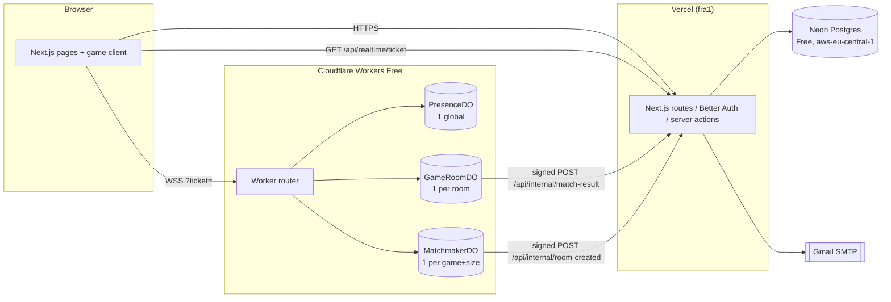

# 01 — Architecture

## Shape: modular monorepo, two deployables

Not microservices. One repo, shared packages, two things deployed:

| Deployable | Platform (free) | Owns |
|---|---|---|
| `apps/web` | Vercel Hobby | Pages, auth, profiles, friends, leaderboards, admin, match-result ingestion, all Postgres access |
| `apps/realtime` | Cloudflare Workers Free | WebSocket connections, rooms, matchmaking queues, presence, turn timers, bots |

## Why this split

- **Vercel can't hold WebSockets** (serverless functions are short-lived). Durable Objects can, and they give us one single-threaded actor per room — perfect for turn-based games (no race conditions, no locks, no Redis).
- **Only `web` talks to Postgres.** The realtime side stays tiny and fast, and the DB schema has exactly one owner. Durable Objects report finished matches over a signed HTTP call.
- **Neon is touched rarely**: signup/login, profile pages, leaderboards, and once per finished match. Never per move. This keeps us far inside Neon's free compute (100 CU-hours/month, scale-to-zero after 5 min idle).

## Regions

- Vercel functions: `fra1` (Frankfurt).
- Neon: `aws-eu-central-1` (Frankfurt). Same city as Vercel functions → DB round-trips are a few ms.
- Durable Objects: created with `locationHint: "weur"`. Cloudflare does **not** currently place Durable Objects in Africa (an `afr` hint falls back to a nearby supported location), so we pin to Western Europe explicitly for predictability. Players still connect to Cloudflare's Lagos edge; traffic rides Cloudflare's backbone to the room.
- Expected move latency from Lagos: ~100–150 ms round trip. Hidden by optimistic UI and animations (see `04-reconnection.md` and `10-performance.md`).

## Request flows

### Page load
Static/cached HTML from Vercel edge → minimal JS → user sees content. Game client JS loads only on `/play/*` routes.

### Opening a socket
1. Client calls `GET /api/realtime/ticket?scope=room:<id>` (cookie session).
2. `web` verifies the Better Auth session, returns a JWT (HS256, 60 s expiry) with `sub`, `name`, `avatar`, `scope`.
3. Client opens `wss://gamehub-realtime.<acct>.workers.dev/parties/room/<id>?ticket=…` via partysocket.
4. Worker verifies the ticket (`jose`), checks `Origin`, then routes to the DO.
5. On every reconnect, partysocket fetches a **fresh** ticket (query is an async function).

### A move
1. Player taps a card → client runs the engine locally to pre-validate and animate optimistically.
2. Client sends `{t:"act", id, v, a}`.
3. DO validates against authoritative state with the same engine, persists one row, resets the turn alarm, broadcasts each seat's new view.
4. Client reconciles: if the server's `v` matches its optimistic prediction, nothing visible happens; if rejected, it snaps to the server view with a short shake.

### Game end
DO computes final ranking → POSTs signed result to `web` → `web` writes `match` + `match_player`, updates ratings (if ranked) → DO broadcasts `ended` with rating deltas returned by `web` (or "unranked").

## Packages

| Package | Contents | Runs in |
|---|---|---|
| `engine` | Game definitions, rule configs/presets, reducers, view projection, bots, seeded RNG | Worker + browser + tests |
| `protocol` | Zod schemas for every WS message and internal HTTP payload; shared constants (limits, codes) | Worker + browser + web server |
| `db` | Drizzle schema, migrations, query helpers | web server only |
| `ui` | Design tokens, primitives, game pieces (Card, Board, Die, Seed) | browser |
| `config` | tsconfig/eslint/tailwind presets | build |

## Scaling path (only when needed)

1. Free tier exhausted → Workers Paid ($5/mo) — needs a card, so only when you decide.
2. PresenceDO hot → shard by `hash(userId) % N`.
3. Matchmaking slow → add rating bands once concurrent players justify it.
4. Nothing in this design needs Redis, queues, or Kubernetes.
