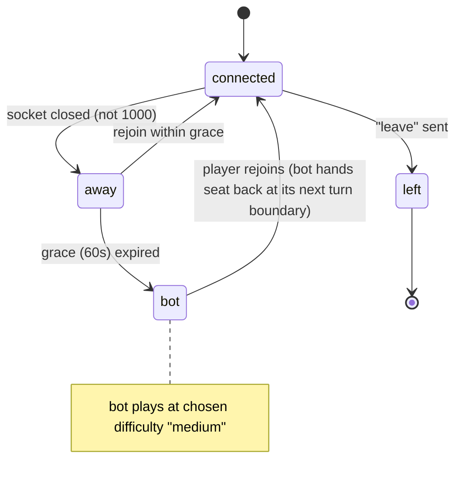

# 04 — Connection & reconnection

Most failures in Nigeria are not slow downloads — they're drops: switching Wi-Fi ↔ data, brief signal loss, Android killing a backgrounded tab. Reconnection is a first-class feature.

## Goals

- A player who drops for ≤ 60 s rejoins the **same seat** with the **exact current state**, no page reload.
- Nobody waits on a missing player: turn timers keep running; bots step in.
- A returning player always gets their seat back, even after a bot played for them.

## Seat states



- **away**: seat held. If it's their turn, the turn timer still runs. On turn timeout → auto-action (see per-game "timeout action") — not a bot yet.
- **bot**: after 60 s grace. Bot plays every turn instantly-ish (300–900 ms think delay for natural feel).
- **left**: voluntary leave or 3 consecutive timeouts while connected (AFK). Bot takes over permanently; the player can still rejoin as long as the game runs (fair: the seat is theirs). For ranked games, a player who ends the game as `left` is ranked last.

## Client: partysocket setup

```ts
// apps/web/src/features/realtime/use-room-socket.ts
import PartySocket from "partysocket";

export function createRoomSocket(roomId: string, onMessage: (m: ServerMsg) => void) {
  const socket = new PartySocket({
    host: process.env.NEXT_PUBLIC_REALTIME_HOST!,   // gamehub-realtime.gamehub-app.workers.dev
    party: "room",
    room: roomId,
    // fresh ticket on EVERY (re)connect — tickets live 60 s
    query: async () => ({ ticket: await fetchTicket(`room:${roomId}`) }),
    minReconnectionDelay: 300,
    maxReconnectionDelay: 8000,
    reconnectionDelayGrowFactor: 1.6,   // backoff (jitter added by partysocket's randomization)
    maxRetries: Infinity,
    maxEnqueuedMessages: 0,             // never replay buffered game actions after reconnect
  });

  socket.addEventListener("open", () => socket.send(JSON.stringify({ t: "hello", lastV: store.getState().v })));
  socket.addEventListener("message", (e) => {
    const parsed = ServerMsg.safeParse(JSON.parse(e.data));
    if (parsed.success) onMessage(parsed.data);
  });
  socket.addEventListener("close", (e) => {
    if ([1000, 4001, 4004, 4008].includes(e.code)) socket.close(); // stop retrying
  });

  // Come back immediately when the user returns to the tab / network returns
  const kick = () => { if (socket.readyState !== WebSocket.OPEN) socket.reconnect(); };
  document.addEventListener("visibilitychange", () => document.visibilityState === "visible" && kick());
  window.addEventListener("online", kick);
  return socket;
}
```

`maxEnqueuedMessages: 0` matters: an action queued while offline might be stale by the time we reconnect. Instead, the client keeps pending optimistic actions in its store and **re-decides** after the fresh snapshot (usually by just dropping them and letting the player tap again).

Check exact option names against the partysocket version you install.

## Client: connection UI

| Condition | UI |
|---|---|
| Open, RTT < 400 ms | Nothing |
| Open, RTT ≥ 400 ms (from `ping`) | Small amber "Slow network" dot |
| Closed < 3 s | Nothing (most blips heal) |
| Closed ≥ 3 s | Top banner "Reconnecting…" + countdown of the 60 s grace; board dimmed, inputs disabled |
| Grace expired, still offline | "A bot is playing for you. You'll get your seat back when you reconnect." |
| Other player away | Their avatar greyed with a ring countdown; "Tunde is offline (0:42)" |
| Other player is bot | Small robot badge on avatar |

## Server: GameRoomDO side

Using PartyServer with hibernation. Per-connection data (user id, seat) lives in `connection.setState()` (persisted via socket attachment, ≤ 2 KB) so it survives hibernation with **zero storage writes**.

```ts
// apps/realtime/src/rooms/game-room.ts (sketch)
import { Server, type Connection, type ConnectionContext } from "partyserver";

export class GameRoom extends Server<Env> {
  static options = { hibernate: true };
  private room!: PersistedRoom;          // loaded lazily, lost on hibernation → reload in onStart

  async onStart() {
    this.room = loadRoom(this.ctx.storage.sql); // 1 row read
  }

  async onConnect(conn: Connection<ConnState>, ctx: ConnectionContext) {
    const claims = (ctx.request as any).__claims as TicketClaims; // set by Worker router after verifyTicket
    const seat = this.room.seats.findIndex((s) => s.userId === claims.sub);

    // one socket per user: close any older one
    for (const c of this.getConnections<ConnState>()) {
      if (c.id !== conn.id && c.state?.userId === claims.sub) c.close(4001, "replaced");
    }
    conn.setState({ userId: claims.sub, seat: seat >= 0 ? seat : "spectator" });

    if (seat >= 0) {
      const s = this.room.seats[seat]!;
      const wasAwayOrBot = s.status !== "connected";
      s.status = "connected";
      delete this.room.deadlines.grace[seat];
      // bot keeps the current turn if mid-turn; hands back at next turn boundary
      if (wasAwayOrBot) { this.persistAndReschedule(); this.broadcastSeat(seat); }
    }
    // snapshot is sent on "hello"
  }

  async onClose(conn: Connection<ConnState>) {
    const st = conn.state; if (!st || st.seat === "spectator") return;
    const stillConnected = [...this.getConnections<ConnState>()].some((c) => c.state?.userId === st.userId && c.id !== conn.id);
    if (stillConnected) return;
    const s = this.room.seats[st.seat]!;
    if (s.status === "connected") {
      s.status = "away";
      this.room.deadlines.grace[st.seat] = Date.now() + GRACE_MS; // 60_000
      this.persistAndReschedule();   // 1 row + (maybe) 1 alarm write
      this.broadcastSeat(st.seat);
    }
  }

  async onAlarm() {
    const now = Date.now();
    // 1) grace expirations → status "bot"
    // 2) turn timeout → timeout action (or bot move if seat is bot)
    // 3) bot think-time deadlines → bot plays (chain consecutive bot turns in memory)
    // then persist ONCE and set alarm to the next earliest deadline
  }
}
```

### One alarm, many deadlines

A DO has only one alarm. Keep all deadlines in the persisted room state:

```ts
type Deadlines = {
  turn?: number;                       // current turn timeout
  grace: Partial<Record<number, number>>; // per seat
  bot?: number;                        // next bot action
  idle?: number;                       // lobby/ended cleanup
};
function nextAlarm(d: Deadlines) { return Math.min(...[d.turn, d.bot, d.idle, ...Object.values(d.grace)].filter(Boolean) as number[]); }
```

`persistAndReschedule()` writes the state row and calls `setAlarm(next)` **only if `next` changed** (each `setAlarm` costs a row write — see `13-free-tier-budget.md`).

### Snapshot on hello

On `hello`, always send a full `snapshot` for that connection's seat (or spectator view), including `deadlines.turnEndsAt` and grace end times so the client can render countdowns with server time. Clock skew: client computes `offset = serverNow - clientNow` from `pong` and corrects countdowns.

## Turn timeout actions (when seat is away or AFK)

| Game | Timeout action |
|---|---|
| Whot | Draw from market (or accept pending pick penalty) |
| Ludo | Roll; if a move exists, move the seed furthest from home that is legal (simple, deterministic) |
| Snakes & Ladders | Roll and move |
| Tic-tac-toe | Bot (easy) picks a cell |
| RPS | Random throw (server RNG) |
| Chess / draughts (clock) | The **clock** decides: the side to move flags at its flag time (draw if the opponent can't mate). No separate turn timer |
| Chess / draughts (no clock) | Per-move limit `moveLimitSeconds` → an Easy-bot move |
| Property | Per phase: roll → `roll`; buy/decline → `decline` (auction); auction → `pass_bid`; raise cash → auto-sell/mortgage least valuable, else bankruptcy; manage → `end_turn`; offers to you expire (declined) |
| Football Draft | Draft pick → server auto-pick (best fit); arrange / half-time / between matches → keep the current team |
| Tournament tables | Same as the game; the seat always stays the player's |

Connected player who times out 3 consecutive turns → `left` (AFK) → bot.

## Testing (must have)

- Playwright: player A disconnects via `context.setOffline(true)` for 10 s → rejoins → same seat, same hand, correct turn.
- Offline 70 s → bot played at least one turn → rejoin → player controls seat at next turn.
- Two tabs same user → older tab gets 4001 screen.
- DO test: hibernate (evict) between moves → state reloads identically.

## New games and modes: disconnect policy

| Situation | Policy |
|---|---|
| **Ranked chess** (public quick-match) | Clock keeps running. **No bot takeover.** After the 60 s grace the opponent may **Claim win** (or **Claim draw** if they lack mating material) or keep waiting; if the absent player returns first, play continues; otherwise they flag. |
| Unranked / private / tournament chess and draughts | Standard: after the 60 s grace a **Medium** bot plays the seat **on that player's remaining clock** until they return (hand-back at the next move boundary). Ranked draughts follows the ranked-chess rule. |
| Property **auction** in progress | A disconnected player simply doesn't bid; a bot-covered seat bids with the bot valuation. Auctions are never paused. |
| Property **trade offers** | Offers to an away player stay open until they expire (60 s); offers *from* them stay open too. A bot-covered seat answers by valuation. |
| Football **draft** | Pick clocks never pause; missed picks are auto-picked; on return the manager continues from the current pick. Picks are checkpointed (every 4th pick + socket attachment, `football-draft/draft.md`). |
| Football **match** | Nothing to do during a half; the snapshot carries the half's events and `startedAt` so the client jumps to "now". Missed half-time window → no changes. |
| **Tournament** seats | The seat stays the player's at every table: grace → bot, the bot can advance; the lobby sends a returning player to their current table. Nobody is eliminated by a drop alone (`16-tournaments.md`). |
