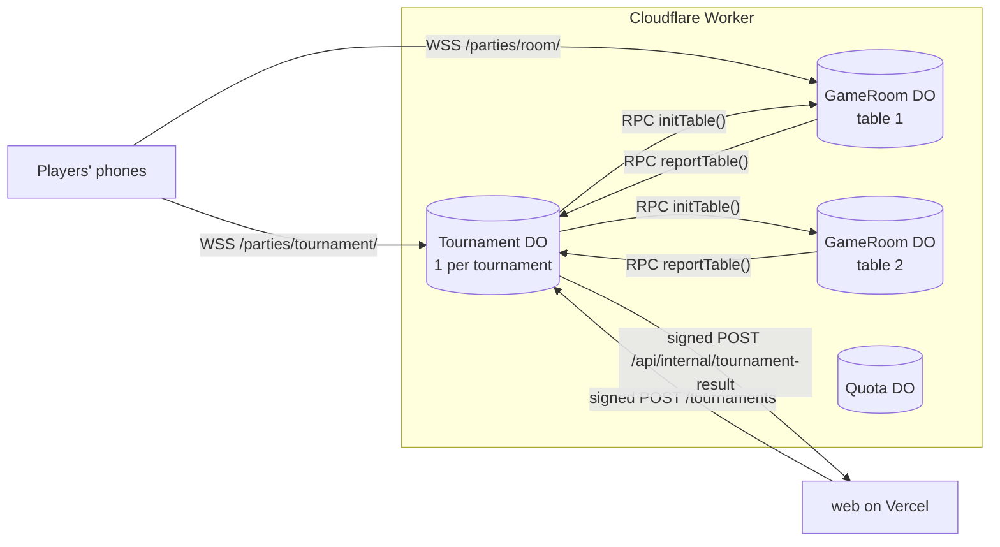
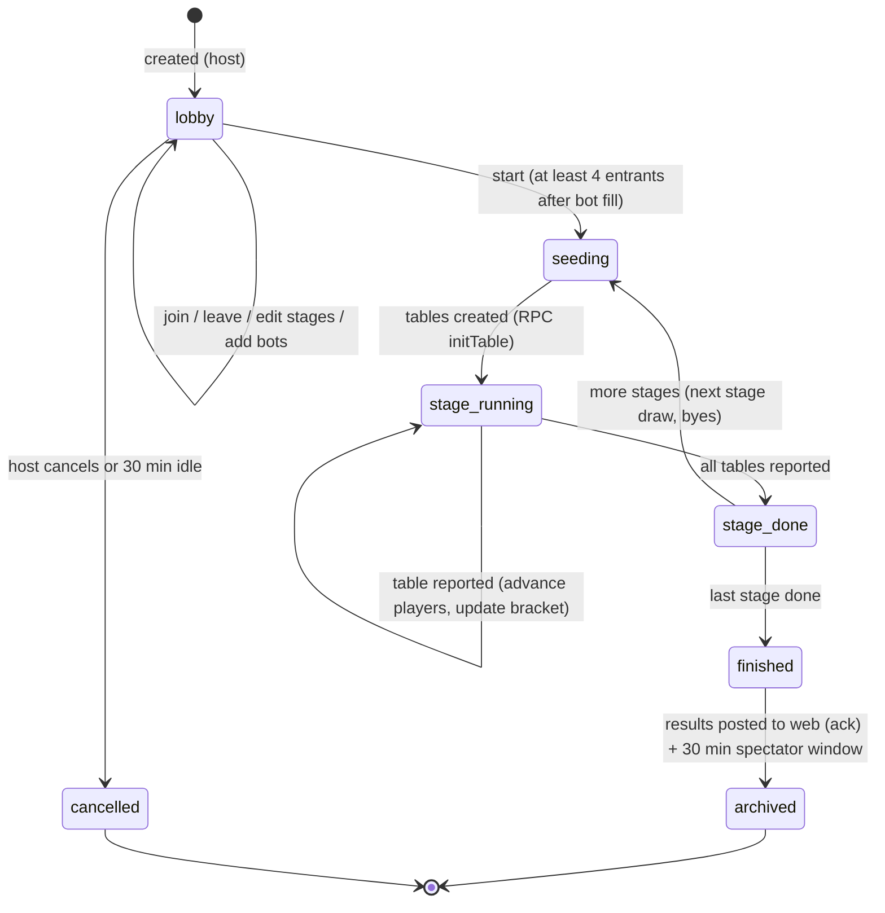

# 16 — Tournament mode

A **private-lobby** mode that strings our games together into stages. The host creates a tournament, people join by code or WhatsApp link, the server seeds random tables, players are sent from table to table automatically, and the bracket updates live. **Unranked. No prizes.**

Sources: `docs/research/sources.md` → "Tournaments" (Board Game Arena multiplayer elimination problems; start.gg free-for-all groups).

## What the host sets

| Setting | Values |
|---|---|
| Name | 3–40 chars, profanity-checked |
| Entrants | **4–32** |
| Bots fill empty entrant slots at start | on/off + level (Easy/Medium/Hard). Bot entrants play like anyone and **can advance** |
| Stages | 1–6, each: **game** (any game incl. Football Draft), **rules** (that game's rules sheet), **table size**, **advance per table** (multiplayer) or **best of N** (1v1 games, winner advances) |
| Start | Manual ("Start tournament"), or auto when full |
| Spectators | on/off (eliminated players always watch) |

Example: *Stage 1 Whot, tables of 4, top 2 advance → Stage 2 Ludo, tables of 4, top 2 → Stage 3 Chess 3+2 knockout → Final: Football Draft single match.*

### Stage validation (at creation and again at start with the real count)
```ts
function validate(stages: Stage[], entrants: number): string[] {
  const errors: string[] = [];
  let n = entrants;
  stages.forEach((s, i) => {
    const g = gameFor(s.game);
    const last = i === stages.length - 1;
    if (s.tableSize < g.minPlayers || s.tableSize > g.maxPlayers) errors.push(`Stage ${i + 1}: ${g.name} tables must be ${g.minPlayers}–${g.maxPlayers}`);
    if (s.tableSize > n) errors.push(`Stage ${i + 1}: only ${n} players left`);
    if (g.maxPlayers === 2 || s.tableSize === 2) {                 // 1v1: knockout rounds inside the stage
      s.advancePerTable = 1;
      n = last ? 1 : nextPow2Rounds(n, s.roundsInStage);          // a 1v1 stage runs knockout rounds until its target count
    } else {
      if (s.advancePerTable < 1 || s.advancePerTable >= s.tableSize) errors.push(`Stage ${i + 1}: advance 1–${s.tableSize - 1}`);
      n = advancing(n, s.tableSize, s.advancePerTable);            // see "Tables" below
    }
  });
  if (n !== 1) errors.push("The last stage must end with one winner");   // last stage: a single table, or 1v1 to a final
  return errors;
}
```
A 1v1 stage plays **knockout rounds** until it reaches the number of players the next stage needs (a power of two when the next stage is also 1v1), or one champion if it's the last stage. The host sees the projected flow ("32 → 16 → 8 → 4 → 1") as they edit.

## Tables and byes

### Multiplayer stages (table size T ≥ 3)
- Tables `t = ceil(n / T)`; players spread **as evenly as possible** (table sizes differ by at most one). **No byes** in multiplayer stages.
- Each **full** table advances K; a smaller table (T − 1 seats) advances `ceil(K × size / T)`, never fewer than 1 and never all of it. Example 13 players, Whot T = 4, K = 2 → tables 4, 3, 3, 3 → advance 2 + 2 + 2 + 2 = 8.
- Because seats are spread evenly, a table smaller than the game's minimum is never formed (e.g. 9 players with Whot tables of 4 → 3, 3, 3 rather than 4, 4, 1).
- This avoids BGA's known problem of a final table made of one advancer and three bye players.

### 1v1 stages (byes)
If `n` isn't a power of two, `B = 2^ceil(log2 n) − n` players get a **bye** in the first round of the stage, so every later round is a power of two.

**Bye order (fair, Proposal):**
1. players with the **fewest byes received** so far in the tournament;
2. then, among those, the **better placing** in the previous stage (finishing 1st at your table counts for more than 2nd);
3. then **random** (server RNG).
Bots get byes last only if `fewest byes` ties with humans (no favouritism otherwise).

```ts
function byes(players: Entrant[], prevPlace: Map<EntrantId, number>, rng: Rng): EntrantId[] {
  const b = nextPow2(players.length) - players.length;
  const ranked = rng.shuffle(players).sort((x, y) =>
    x.byes - y.byes || (prevPlace.get(x.id) ?? 99) - (prevPlace.get(y.id) ?? 99));
  return ranked.slice(0, b).map((p) => p.id);
}
```
**Seeding** of the first stage is random (server RNG). Later stages: random draw among advancers, avoiding rematches of the previous table when possible (one reshuffle attempt).

### Ties at advancement
1. The game's own placing (most games already break ties: Whot hand totals, Ludo progress, property net worth, football goal difference…).
2. Game-specific secondary tiebreaker (Whot: fewer cards; Ludo: seeds home then total steps; property: cash; RPS/TTT/chess/draughts: n/a — 1v1 has a winner or a decider game).
3. **Server coin flip** (seeded, logged in the bracket as "decided by coin toss").
A 1v1 draw (chess/draughts) in a tournament plays a **decider**: one more game with colours swapped and a shorter clock (e.g. 3+2), then a coin flip if that's drawn too (Proposal; host can choose "Armageddon-free coin flip" vs "decider game").

## Disconnects and abandonment
- **The seat stays the player's.** After the 60 s grace a bot plays for them (standard rule, including in chess — tournaments are never ranked) **and can advance** on their behalf.
- When they return they take over at the next turn boundary, at any table they've been moved to (the lobby sends them to their current table).
- **Nobody is eliminated by a network drop alone** — only by results.
- If they never come back, the bot keeps playing their seat to the end; their final placement is recorded with `playedByBot = true` (shown as "finished by bot" on their profile).
- A player who presses **Leave tournament** is replaced by a bot for the rest of the event (like `leave` in rooms) and can't rejoin.

## Football Draft inside a tournament
**Proposal:** each player drafts **once**, at the first football stage, and keeps that squad for every later football stage (lineup, roles and tactics can change between stages). The squad is stored in the Tournament DO and passed to each football table at creation (`games/football-draft/modes.md`).

## Architecture



- **`Tournament` DO** (new SQLite class, **new migration tag `v2`** — never edit `v1`): owns the bracket and stage state, creates tables, receives results, advances players, pushes live updates, sends players to their next table.
- **Tables are ordinary `GameRoom` DOs** created by RPC `initTable({ code, game, rules, seats: [...entrants], tournament: { id, code, stage, table } })`. A tournament table has fixed seats (by user id or bot), no lobby edits, and **auto-starts** when all humans have connected or 60 s after creation (absent humans begin "away" → grace → bot).
- On finish, the room calls `Tournament.reportTable({ stage, table, ranking, playedByBot })` (RPC through the DO binding — same Worker, no HMAC needed). Retries with backoff from the room's alarm until acknowledged.
- The Tournament DO posts the **final standings** to `web` once (HMAC-signed, `/api/internal/tournament-result`), and each finished table as a `match` row (`kind: "tournament"`, unranked) in the same call batch.
- Codes: tournaments use **7-character** codes from the room alphabet (`/t/ABCD234`), so the join box tells rooms (6) and tournaments (7) apart by length.

## State machine



1v1 stages loop `stage_running` round by round (each knockout round is a set of tables).

```ts
type TournamentState = {
  code: string; name: string; hostUserId: string;
  phase: "lobby" | "seeding" | "stage_running" | "stage_done" | "finished" | "archived" | "cancelled";
  entrants: Array<{ id: string; userId: string | null; name: string; avatar: string | null; isBot: boolean;
                    botLevel?: BotLevel; status: "in" | "out" | "left"; byes: number; playedByBot: boolean }>;
  stages: Array<{ game: GameSlug; rules: unknown; tableSize: number; advancePerTable: number; bestOf?: number }>;
  stage: number; round: number;                                  // round = knockout round inside a 1v1 stage
  tables: Record<string, { stage: number; round: number; seats: string[]; status: "pending" | "running" | "done";
                           ranking?: string[][]; decidedBy?: "play" | "coin" }>;
  footballSquads: Record<string, TeamSheet>;                     // drafted once (Proposal)
  placements: Array<{ entrant: string; place: number; outAtStage: number | null }>;
  rngSeed: string; rngCounter: number;
  deadlines: { idle?: number; tableStart?: Record<string, number>; reportRetry?: number };
  resultReported: boolean;
};
```

**Placements:** the champion is 1st; the final table's order gives the next places; players knocked out in the same stage share a place band ordered by their table finish (e.g. "=9th").

## Protocol (tournament lobby socket)

`/parties/tournament/<code>`, ticket scope `tournament:<code>`.

| Dir | `t` | Payload | Limit |
|---|---|---|---|
| C→S | `t_hello` | `{}` | — |
| C→S | `t_join` / `t_leave` | `{}` | 1/s |
| C→S | `t_config` | `{ name, entrants, botFill, stages }` (host, lobby) | 1/s |
| C→S | `t_kick` | `{ entrant }` (host, lobby) | 1/s |
| C→S | `t_start` | `{}` (host) | — |
| C→S | `t_cancel` | `{}` (host, lobby) | — |
| S→C | `t_snapshot` | `{ v, state: TournamentPublic, you: EntrantId \| "spectator", serverNow }` | — |
| S→C | `t_event` | `{ e: "stage_started" \| "table_done" \| "advanced" \| "eliminated" \| "champion", … }` | — |
| S→C | `t_go` | `{ table: string }` — "your table is ready" → client navigates to `/r/<table>` | — |
| S→C | `error` | room error codes + `TOURNAMENT_FULL`, `BAD_STAGES` | — |

Room snapshots of a tournament table carry `room.tournament = { code, stage, table }` so the room screen shows "Stage 2 · Table 3" and a "Back to tournament" button (auto-redirect 5 s after the result). Zod schemas live in `packages/protocol/src/tournament.ts`.

## Data model (Neon)
See `07-database.md`: `tournament`, `tournament_stage`, `tournament_entry` (final place, out-at-stage, `played_by_bot`). The profile shows **tournament wins** (place 1) and **podiums** (places 1–3). Unranked.

## Free-tier budget
Per-game costs come from `13-free-tier-budget.md`. Example **32 players, 4 stages**:

| Stage | Tables | Rows (each) | Rows |
|---|---|---|---|
| 1 · Whot, 8 tables of 4, top 2 → 16 | 8 | ~240 | ~1,900 |
| 2 · Ludo, 4 tables of 4, top 2 → 8 | 4 | ~900 | ~3,600 |
| 3 · Chess 3+2 knockout 8 → 2 (2 rounds, 6 games) | 6 | ~150 | ~900 |
| 4 · Football Draft final (draft + match) | 1 | ~25 | ~25 |
| Tournament DO (lobby, seeding, ~20 reports, snapshots) | — | — | ~80 |
| **Total** | | | **≈ 6,500 rows ≈ 6.5 % of the 100k daily limit**; requests similar (≈ 6–7 % of 100k) |

Ludo dominates; a 32-player Ludo-only tournament (3 stages) costs ≈ 12–15 % of the day.

**Host warning:** when the host edits stages, the lobby shows an estimate from the per-game table ("This tournament uses about 6 % of GameHub's free daily capacity"). If the estimate is > 15 % of the daily limit, or if today's usage (from the `Quota` DO's daily counters) plus the estimate would pass 80 %, the host sees: "This is a heavy tournament for today. It may not finish if GameHub gets busy. Try fewer Ludo stages or start after 1:00 AM." Start is still allowed.

## Tests
- Bracket property tests (fast-check, ≥ 1,000 runs): random entrant counts 4–32 and random valid stage lists → every entrant gets a place; no one plays two tables at once; table sizes within game limits and differ by ≤ 1; 1v1 rounds after byes are powers of two; byes go to fewest-byes first; the tournament ends with exactly one champion.
- Validation errors for impossible stage lists.
- DO tests: create → seed → tables created by RPC → reports advance players → final result posted once (idempotent); a disconnected entrant's bot advances; a table report arriving twice is ignored.
- E2E: 4 humans + 4 bots, two stages (Whot table of 4 → RPS 1v1), players auto-navigate to tables and back.
