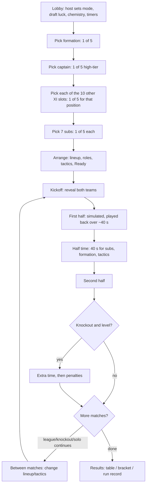

# Football Draft

Best's original game. Each manager builds a starting XI and bench from **real footballers** — current stars, **Legends** at their prime, **Wonderkids**, and lots of Nigerian and African players — by picking **1 of 5** options for every spot. Then the teams play **simulated matches**, shown as live text commentary with a stats ticker.

- Slug: `football`. Players: 1 (solo run) or 2–8 managers. Unranked. No rewards, no packs, no coins.
- Not affiliated with any club, league, player, EA or FIFA. Names and public facts only; **our own ratings**; no photos, badges, kits or logos (`player-database.md`, `concerns.md`).

## Modes
| Mode | Who | What |
|---|---|---|
| Head-to-head | 2–8 managers in a private room | 2: single match (or best of 3) · 3–8: mini league or knockout |
| Solo run | 1 manager | Up to 4 knockout matches vs bot XIs of rising strength; one loss ends the run; record "best run 4/4" |
| Tournament stage | Any tournament | Draft once at the first football stage, keep the team (`modes.md`) |

## Flow

## Glossary
| Term | Meaning |
|---|---|
| Manager | A player in a football room (seat). |
| Option set | The 5 choices offered for one pick — private to that manager. |
| Draft luck | Room rule choosing the probability preset (Balanced, Wild, Elite). |
| OVR | Our overall rating, 1–99 (best current ≈ 91). |
| Face stats | Six stats on a card: Speed, Finishing, Passing, Skill, Defending, Power (keepers: Shot-stopping, Reactions, Handling, Command, Distribution, Agility). |
| Legend | Retired great, rated at his prime, with an era tag. |
| Wonderkid | Under-21 player, rated on current ability, with a potential tag. |
| Role / focus | How a player plays in his slot (e.g. Inside forward → Shoot). |
| Familiarity | How well a player knows a role: ++, +, base, out of position. |
| Chemistry | Points from shared nation/club (Proposal, on by default). |
| Team rating | Mean effective OVR of the XI with a small star bonus. |

## Documents
| File | Contents |
|---|---|
| [draft.md](draft.md) | Pick flow, timers, auto-pick, probability tiers, guarantees, Draft luck presets, hidden info, simulation targets |
| [player-database.md](player-database.md) | Schema, rating methodology, face stats, quotas, validation, batches, updates, sources policy |
| [tactics.md](tactics.md) | Positions, 18 formations with coordinates, team tactics and their effects, roles and focuses, familiarity, chemistry, half-time |
| [match-engine.md](match-engine.md) | Simulation model, events, calibration targets, extra time and penalties, CPU and persistence, commentary, Monte Carlo tests |
| [modes.md](modes.md) | Head-to-head, league, knockout, solo run, tournament integration, state and actions, reconnection, costs |
| [../../../packages/football-data/README.md](../../../packages/football-data/README.md) | The data package and the 60-player sample file |
| [../../16-tournaments.md](../../16-tournaments.md) | Tournament stages (football inside tournaments) |

## Engine placement
`packages/engine/src/games/football/` holds the draft rules, option-set sampler, match engine and bots — all pure. The engine never imports the data package: the realtime Worker loads `@gamehub/football-data` and passes the dataset into `createFootballGame(dataset)` (keeps the "engine → nothing" dependency rule, `AGENTS.md` §3).
